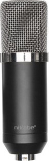
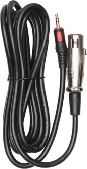
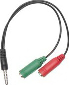
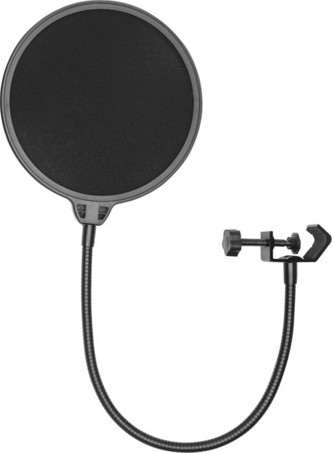
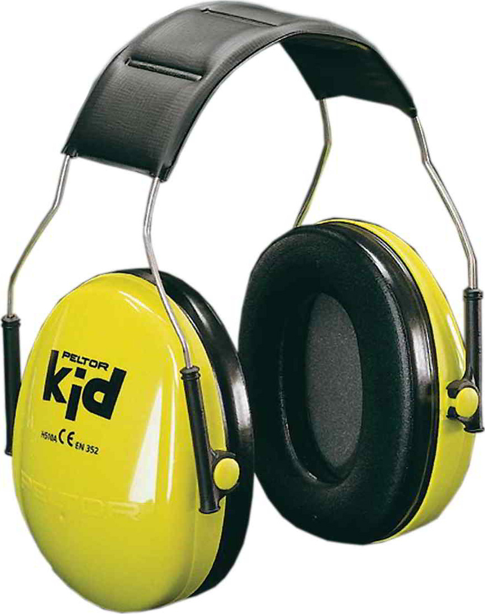

# Inspelning

## Utrustning

Samla ihop följande:

* Mikrofon
* Mikrofonsladd
* Tudelad sladd
* Puffskydd
* Hörlurar
* Hörselkåpor
* Dator
* Material för att bygga en monolit för mikrofonen att vila på

 |  |  |  | 
------------ | ------------- | ------------- | ------------- | -------------
Mikrofon | Mikrofonsladd | Tudelad sladd | Puffskydd | Hörselkåpor 

## Montering

1. Koppla in mikrofonsladded
