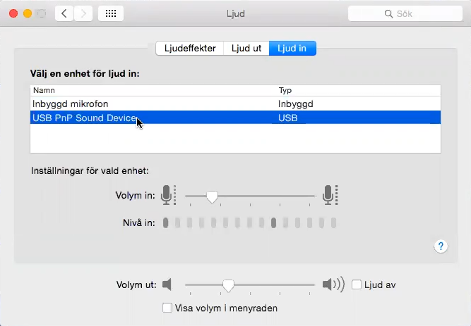

# Inspelning

## Utrustning

Samla ihop följande:

* Mikrofon
* Mikrofonsladd
* USB-kontakt
* Puffskydd
* Små hörlurar
* Hörselkåpor
* Dator
* Material för att bygga en monolit för mikrofonen att vila på
* Underlägg för eventuell dryck

 |  |  |  | 
------------ | ------------- | ------------- | ------------- | -------------
Mikrofon | Mikrofonsladd | USB-kontakt | Puffskydd | Hörselkåpor 

## Montering

1. Koppla in mikrofonen i mikrofonsladden
2. Koppla in mikrofonsladden i USB-kontaktens hål som är märkt med en mikrofon
3. Koppla in dina små hörlurar i USB-kontaktens hål som är märkt med en hörlur
4. Koppla in USB-kontakten i din dator
5. Bygg en monolit för mikrofonen att vila på
6. Fäst puffskyddet i monoliten så att den är mellan mikrofonen och din mun
7. Se till att ingen del av din kropp vidrör monoliten, mikrofonen eller puffskyddet
8. Stoppa in dina små hörlurar i dina öron
9. Sätt på dig hörselkåporna utanpå dina öron
10. Ställ eventuell dryck på ett underlägg

## Datorinställningar

1. Starta datorn
2. Stäng ner alla program
3. Öppna en browser, gå till Facebook och anslut till vårt telefonsamtal i gruppchatten
4. Öppna datorns inställningar (klicka på äpplet längst upp till vänster och välj **Systeminställningar**)
5. Gå till **Ljud**-inställningar
6. Gå till **Ljud in**-fliken
7. Säkerställ att det står *USB PnP Sound Device* i listan
8. Ställ in volymen så att handtaget är ungefär som på bilden nedan
9. Gå till **Ljud ut**-fliken
10. Säkerställ att det står *USB PnP Sound Device* i listan
11. Sänk volymen så att du precis hör oss andra

## Inspelning

1. Öppna **QuickTime Player** genom att klicka på förstoringsglaset längst upp till höger i datorn och börja skriv "Quicktime"
2. Gå till *Arkiv* > *Ny ljudinspelning*
3. Klicka på den nedåtriktade pilen bredvid den röda runda inspelningsknappen och säkerställ att:
 * *USB PnP Sound Device* är valt
 * *Maximal* är valt
4. Starta inspelningen

## Efterspel

1. Spara filen i **QuickTime Player** med ditt namn och dagens avsnitt, t ex *"bor_mattias_e07"* på skrivbordet
2. Gå till skrivbordet i Finder
3. Ctrl+klicka på filen och välj "Komprimera" filen till en zip-fil
4. Gå till https://mega.nz/fm/69ZGjIoJ
5. Klicka på "File Upload" och välj zip-filen
6. Kontakta Oskar när filen har laddats upp

